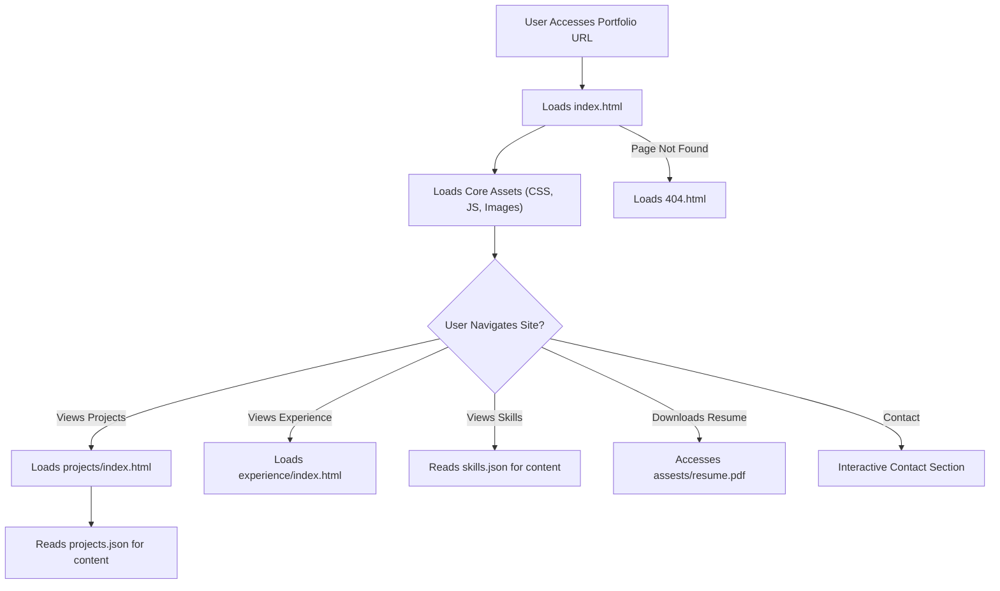

# 🚀 Dynamic Developer Portfolio

<p align="center"></p>

## Short Description
Presenting a cutting-edge, responsive, and highly customizable personal portfolio website designed to be your ultimate digital resume. This project empowers developers to elegantly showcase their skills, projects, and professional journey to the world. Built with modern web technologies and optimized for seamless user experience, it's the perfect platform to make a memorable first impression.

## ✨ Key Features
*   **Immersive Project Showcase:** A dynamic gallery to display your work, complete with descriptive details loaded from `projects.json`.
*   **Comprehensive Skill Inventory:** Clearly enumerate your technical competencies and tools mastered, driven by `skills.json`.
*   **Interactive Experience Timeline:** Visualize your professional growth and milestones with dedicated sections for work and education.
*   **Sleek & Modern UI/UX:** Engage visitors with a visually appealing design, smooth animations, and interactive elements, potentially enhanced by `particles.min.js`.
*   **Fully Responsive Design:** Adapts effortlessly to any screen size, from desktops to mobile devices, ensuring accessibility for all users.
*   **Direct Resume Download:** Provide prospective employers instant access to your detailed curriculum vitae via an integrated PDF link.
*   **Automated CI/CD Pipeline:** Streamlined development and deployment with GitHub Actions, ensuring a robust and efficient workflow.
*   **Custom 404 Page:** A polished, branded page to guide users smoothly in case of broken links.

## Who is this for?
*   **Emerging & Experienced Developers:** Create a powerful online presence that highlights your capabilities.
*   **Job Seekers:** Impress recruiters and hiring managers with a professional and interactive overview of your career.
*   **Freelancers & Consultants:** Present your services and past successes in a compelling format to attract new clients.
*   **Collaborators:** Easily share your expertise and project interests with potential team members.

## Technology Stack & Architecture
This portfolio website leverages a robust and widely adopted set of frontend technologies, coupled with modern DevOps practices:

*   **Frontend Core:** HTML5, CSS3 (`style.css`, `404.css`), and Vanilla JavaScript (`app.js`, `script.js`, `404.js`).
*   **Dynamic Styling & Effects:** Advanced CSS for modern aesthetics and `particles.min.js` for engaging background animations.
*   **Declarative Content:** JSON files (`projects.json`, `skills.json`) serve as local data stores for easily managing project and skill information without a traditional database.
*   **DevOps:** GitHub Actions (`.github/workflows/ci-cd.yml`) implement a Continuous Integration/Continuous Deployment pipeline for automated builds and deployments (e.g., to GitHub Pages).
*   **Development Environment:** Configured with `.vscode/settings.json` for consistent code quality and developer experience.

## 📊 Architecture & Database Schema
This project functions as a static site, meaning there is no traditional server-side architecture or backend database. Instead, content is loaded dynamically via client-side JavaScript from local JSON files. Below is a high-level representation of the user's interaction flow with the website:



## ⚡ Quick Start Guide
Get your personalized portfolio up and running in minutes!

1.  **Clone the Repository:**
    ```bash
    git clone https://github.com/Pallavikallur31/portfolio_website.git
    ```
2.  **Navigate to the Project Directory:**
    ```bash
    cd portfolio_website
    ```
3.  **Open in Your Browser:**
    Simply open the `index.html` file in your preferred web browser to view the portfolio locally.
    ```bash
    # Example for macOS/Linux
    open index.html
    # Example for Windows
    start index.html
    ```
4.  **Customize Your Content:**
    *   Update `index.html`, `experience/index.html`, and `projects/index.html` with your personal information.
    *   Modify `projects/projects.json` and `skills.json` to showcase your unique work and expertise.
    *   Replace placeholder images in `assests/images/` and `assests/resume.pdf` with your own assets.
5.  **Deployment (Optional):**
    This repository includes a `ci-cd.yml` workflow for GitHub Actions, making it straightforward to deploy your portfolio to platforms like GitHub Pages. Consult the workflow file for setup details.

## 📜 License
This project is licensed under the MIT License - see the [LICENSE](LICENSE) file for details.