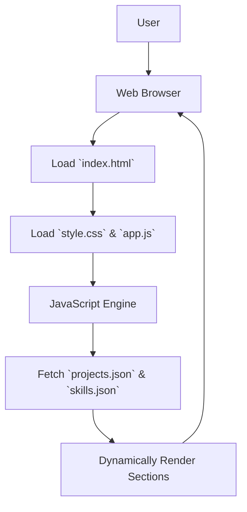

# 🚀 Dynamic Portfolio Website

<p align="center"></p>

## Short Description
Showcase your skills, projects, and professional journey with this elegantly designed, fully customizable portfolio website. Built with modern web technologies, it offers a seamless and engaging experience for visitors, making it the perfect platform to highlight your accomplishments and connect with potential opportunities.

## ✨ Key Features
*   **Stunning & Responsive Design:** A modern, clean, and fully responsive layout ensures your portfolio looks impeccable on any device, from desktops to mobile phones.
*   **Dedicated Project Showcase:** Dynamically load and present your diverse projects with descriptions, images, and links, powered by a simple `projects.json` file.
*   **Comprehensive Skills Section:** Clearly outline your technical proficiencies and tools using a structured `skills.json` file for easy updates.
*   **Professional Experience Timeline:** Detail your professional journey and career milestones in a dedicated section.
*   **Integrated Resume:** Provide a convenient download link for your full resume (`assests/resume.pdf`).
*   **Custom 404 Page:** A branded and user-friendly error page enhances the user experience, guiding visitors back to relevant content.
*   **Efficient Asset Management:** Organized `assests` directory for images, CSS, and JavaScript.
*   **CI/CD Ready:** Includes GitHub Actions workflows (`.github/workflows/ci-cd.yml`) for streamlined deployment and continuous integration.

## Who is this for?
This portfolio website template is ideal for:
*   **Software Developers & Engineers:** To showcase coding projects, technical skills, and career progression.
*   **Designers & Artists:** To display creative works and design portfolios.
*   **Freelancers & Consultants:** To present services, client testimonials, and professional expertise.
*   **Students & Job Seekers:** To build a strong online presence and stand out in the competitive job market.

## Technology Stack & Architecture
This project is a testament to robust frontend development practices, leveraging core web technologies to deliver a fast, static, and interactive experience.

*   **Frontend:**
    *   **HTML5:** For semantic structure and content organization.
    *   **CSS3:** Styling and visual presentation, including responsive design.
    *   **JavaScript:** For dynamic content loading, interactive elements, and enhancing user experience (e.g., `particles.min.js` for background animations).
*   **Content Management:**
    *   **JSON Files (`projects.json`, `skills.json`):** Lightweight, easy-to-manage data storage for dynamic content, allowing for quick updates without touching core HTML.
*   **Development Tools:**
    *   **VS Code Configuration (`.vscode/settings.json`):** Ensures a consistent development environment.
*   **Continuous Integration/Deployment:**
    *   **GitHub Actions (`.github/workflows/ci-cd.yml`):** Automates testing and deployment processes, ensuring code quality and efficient delivery.

## 📊 Architecture & Database Schema
This project follows a classic static site architecture, with content dynamically populated from local JSON files.



## ⚡ Quick Start Guide

Getting your portfolio up and running is incredibly simple:

1.  **Clone the Repository:**
    ```bash
    git clone https://github.com/Pallavikallur31/portfolio_website.git
    cd portfolio_website
    ```

2.  **Open in Browser:**
    Simply open the `index.html` file in your preferred web browser.

3.  **Customize Your Content:**
    *   Edit `index.html` to update static content.
    *   Modify `projects/projects.json` to showcase your latest projects.
    *   Update `skills.json` with your technical proficiencies.
    *   Replace `assests/resume.pdf` with your own resume.
    *   Personalize styles in `assests/css/style.css` and `assests/js/app.js` for custom functionality.

## 📜 License
This project is licensed under the terms of the [MIT License](./LICENSE).